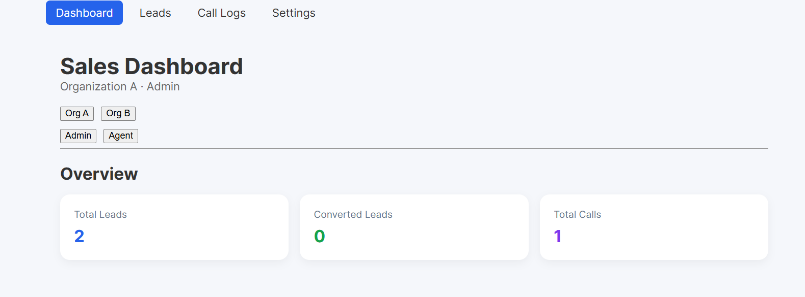
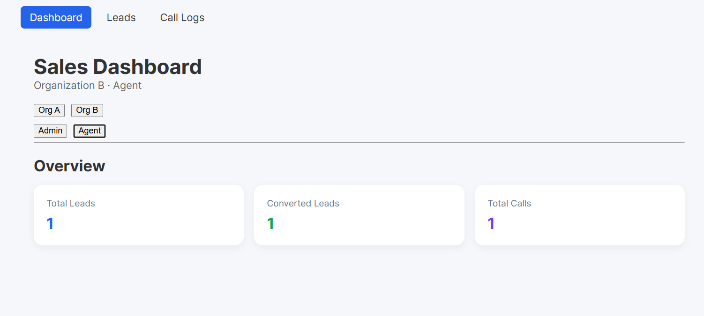
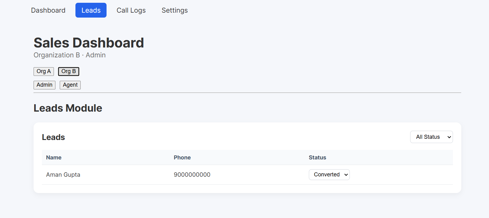
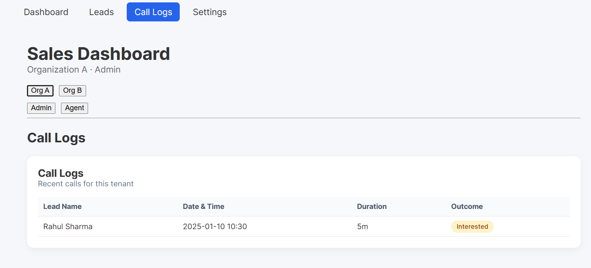
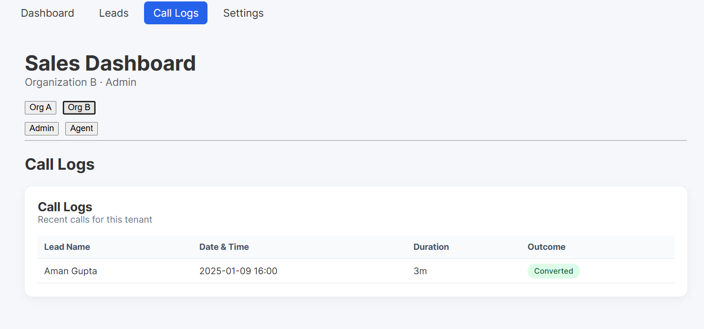
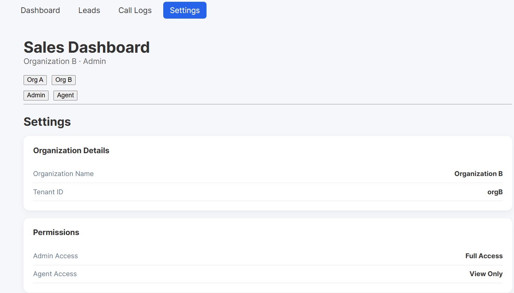

# Multi-Tenant Sales Dashboard (Frontend Assignment)

## Overview
This project is a frontend-only implementation of a **multi-tenant sales dashboard** built using **React + Vite**.  
It simulates a SaaS product used by multiple organizations (tenants) with **role-based access control**.

The focus of this assignment is on:
- Application structure
- Multi-tenancy handling
- Role-based access
- Reusability
- Frontend optimization awareness

No backend or real authentication is implemented, as per assignment requirements.

---

## Tech Stack
- React
- Vite
- React Router DOM
- Context API (state management)
- Plain CSS & inline styles (no UI library)

---
##Screenshots
| Section     | View        | Preview |
|------------|-------------|---------|
| Dashboard  | Admin       |  |
| Dashboard  | Agent       |  |
| Leads      | Org A       |  |
| Leads      | Org B       |  |
| Call Logs  | Org A       |  |
| Call Logs  | Org B       |  |
| Settings   | Admin Only  |  |

## Features

### Multi-Tenancy
- Supports multiple tenants (Organization A & Organization B)
- Each tenant has isolated leads and call logs
- Switching tenant updates data across the application

### Role-Based Access Control
- **Admin**
  - Can edit lead status
  - Can access Settings page
- **Agent**
  - View-only access
  - Restricted from admin-only routes

### Core Modules
- **Dashboard**
  - Summary cards: Total Leads, Converted Leads, Total Calls
- **Leads Module**
  - Tenant-specific leads
  - Status filter
  - Admin-only status editing
- **Call Logs Module**
  - Tenant-specific call logs
- **Settings**
  - Admin-only configuration page (mocked)

---

## Frontend Architecture
```
src/
├── components/
│ ├── common/ # Navbar, shared UI
│ ├── leads/ # Leads module components
│ └── calls/ # Call logs components
├── context/
│ └── AuthContext.jsx
├── data/
│ └── tenants.js # Mock tenant data
├── pages/
│ ├── Dashboard.jsx
│ ├── Leads.jsx
│ ├── CallLogs.jsx
│ └── Settings.jsx
├── routes/
│ └── AppRoutes.jsx

```
- **Context API** manages tenant and role state globally
- Components are reused across tenants
- Pages remain data-agnostic

---

## Optimization Awareness
- Lazy loading & code splitting using `React.lazy` and `Suspense`
- Tenant-based state synchronization using `useEffect`
- Avoided unnecessary re-renders by scoping state locally
- Tables made scrollable for mobile responsiveness

---

## Responsiveness
- Fully responsive layout
- Mobile-friendly navigation
- Scrollable tables on smaller screens
- Dashboard cards adapt using CSS grid

---

## How to Run Locally

```bash
npm install
npm run dev
```

## Open
http://localhost:5173
